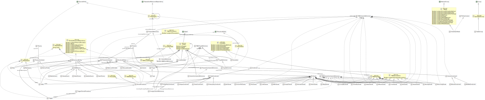

# FamixSQL

This is a metamodel for SQL using the Famix metamodel generator.

It uses ODBC to connect to any database and gather basic schema information.


## Installation

Download a [Moose image](https://modularmoose.org/moose-wiki/Beginners/InstallMoose).

In the Moose image, in a playground (`Ctrl+O`, `Ctrl+W`), perform:

```st
Metacello new
  baseline: 'FamixSQL';
  repository: 'github://moosetechnology/FamixSQL:main/src';
  load.
```

## Main documentation

Please read first the [main documentation here](https://modularmoose.org/moose-wiki/Users/famix-sql/getting-started-with-famixsql)

## UML

UML generated with [plantUML](https://plantuml.com) using the [FamixUMLDocumentor](https://github.com/moosetechnology/Famix/tree/development/src/Famix-UMLDocumentor) (on 2023/10/01)




## Usages

### Model Loading

After loading the project, you should create a connection between Pharo and the database using:

```st
connection := ODBCConnection new.
connection dsn: '<dsn name>'.
connection uid: '<username>'. "Username"
connection pwd: '<password>'. "Password"
connection connect.
```

Then, you can perform the import in a FamixSQL Model.

```st
importer := FamixSQLODBCImporter new.
importer model: FamixSQLModel new.
importer source: connection.

model := importer import.
model.
```

### Analyse the database

Analyse of the database can be performed using [Moose Critics](https://modularmoose.org/posts/2022-08-08-moosecritics).
A first set of rule is available in [this repo](./critics/).

A Roassal3 visualisation of the tables and their link is also available in this package and can be opened by executing the folowing script:

```st
tables := ((model allWithType: FamixSQLTable) first: 10) asMooseSpecializedGroup.

(SQLRSTableGroupBuilder new
  sourceGroup: tables;
  collapseAll;
  build;
  canvas) open.
```

### Common request

One can also perform common request by scripting

#### Table without primary key

```st
(model allWithType: FamixSQLTable) select: [ :table | table columns noneSatisfy: #isPrimaryKeyColumn ]
```

## Acknowledgement

Many thanks to Julien Deplanque who made the [first version of this work](https://github.com/juliendelplanque/FAMIXNGSQL).
If you intend to manipulate **PostgresQL** database, his work will fit your need.
